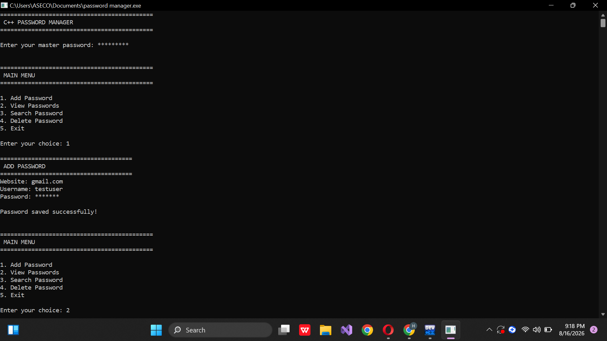
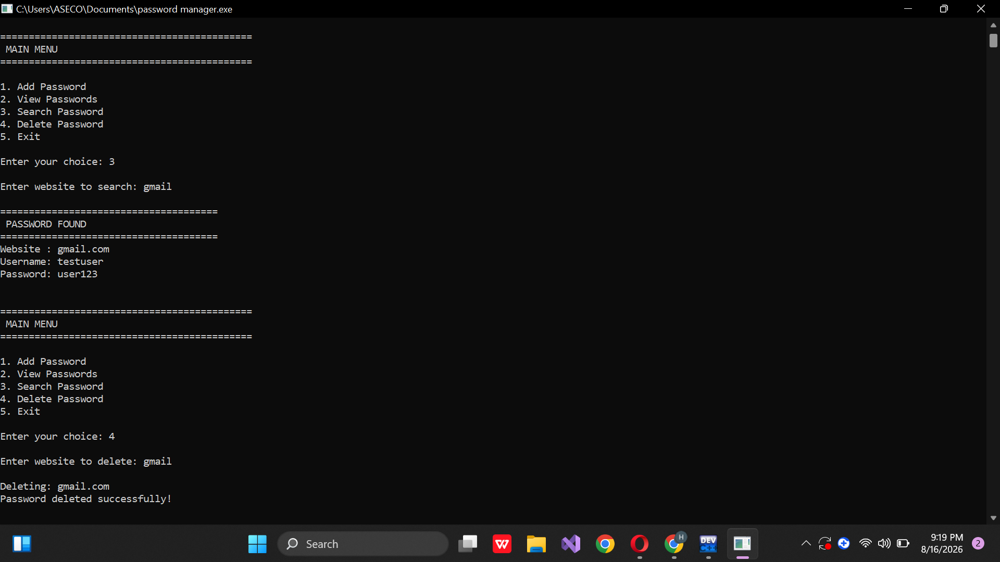

# C++ Encrypted Password Manager

A secure console-based password manager built in C++ with XOR encryption and file persistence.

## Features
- **Master password login** with hidden input
- **Add, View, Search, and Delete** password entries
- **XOR encryption + HEX encoding** for stored data
- **File handling** - data saved in `passwords.txt`
- Clean menu-driven interface

## Technologies Used
C++, OOP, File I/O, String Manipulation, Encryption

## How to Run
1. Open in Dev C++
2. Compile and Run
3. Set a master password and start managing passwords
## Screenshots
## Screenshots

### Main Menu

### View Passwords

